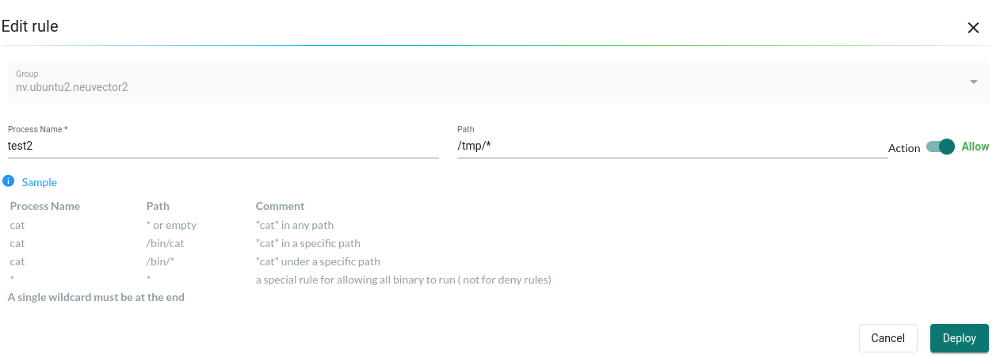
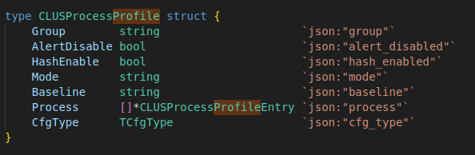
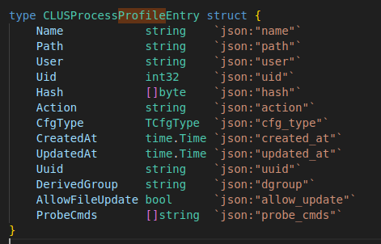

# NeuVector's policy rule

The process policy can be changed in a few ways:

1. Learn from enforcer.
   1. Sync to controller via gRPC APIs.
2. Change from UI
   1. (manager) PATCH /v1/processProfile
   2. (controller) PATCH /v1/process_profile/<group name>

## What the policy looks like



### CLUSProcessProfile



- Group: Group name, which is generated when learning, user action, etc.
- AlertDisable: Apparently not used.
- HashEnable: Whether to verify executable's hash. (agent/policy/process.go)
- Mode: Policy mode
  - PolicyModeLearn       string = "Discover"
  - PolicyModeEvaluate    string = "Monitor"
  - PolicyModeEnforce     string = "Protect"
  - PolicyModeUnavailable string = "N/A"
- Baseline:
  - ProfileDefault_UNUSED string = "default" // (obsolete) it's equal to "zero-drift"
  - ProfileShield_UNUSED  string = "shield"  // (obsolete) it's equal to "zero-drift"
  - ProfileBasic          string = "basic"
  - ProfileZeroDrift      string = "zero-drift"
- Process: The detailed process policy.  Will explain in the next section.
- CfgType:
  - Learned = iota + 1
  - UserCreated
  - GroundCfg
  - FederalCfg
  - SystemDefined

### CLUSProcessProfileEntry



- Name:  The process name to match.  It can be "*" or process name (executable name). 
- Path:  The process path to match.  It can use wildcard but it has to be the end of it, e.g., /usr/*
- User: user NAME, which is retrieved from passwd file.  
- Uid:  user ID, which is from /proc/<pid>/status. (euid)
- Hash: executable hash.  Get from global.SYS.GetFileHash(pid, proc.Path). bpf_ima_inode_hash() & bpf_ima_file_hash()
  - While IMA hash can be used, the algorithm can vary.  In Ubuntu 22.04, sha1 is used by default.
- Action
- CfgType
- CreatedAt
- UpdatedAt
- Uuid
- DerivedGroup
- AllowFileUpdate
- ProbeCmds

## How policies are matched

## TODO

1. CLUSProcessProfile: policy order? Say it matches allow and deny at the same time...
   1. Two sets.  Match deny first, and then allow?
      1. What about allow XXX and deny all?
      2. No decision seems to be related to learning and zero drify policy...
   2. Two approaches
      1. inofity: https://github.com/neuvector/neuvector/blob/e073d8c8611a8d4415326607b879e13dbcd95252/agent/policy/process.go#L108
      2. Fanotify:
         1. fanotify's optimization.  https://github.com/neuvector/neuvector/blob/d61f5402bb86247423b33c3f7ddfe31cb0d8128d/agent/probe/faccess_linux.go#L694
         2. The engine goes through all executables in the container and maintain a map from it.  

   3. 
   4. 
2. CLUSFileAccessRule: 
3. Bash script

  a. -c: bash -c "ls"
  b. stdin: echo ls | bash
  
```
$ sudo ./uprobe 'p:/usr/bin/bash:parse_and_execute +0(%di):string'
Tracing uprobe parse_and_execute (p:parse_and_execute /usr/bin/bash:0xade20 +0(%di):string). Ctrl-C to end.
           <...>-110276  [012] DNZff 27723.657137: parse_and_execute: (0x55f148c3ce20) arg1="ls"
```

